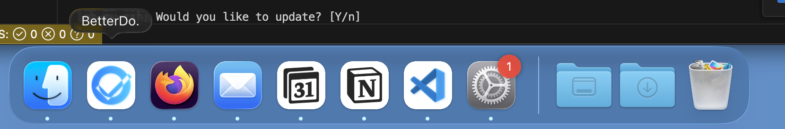
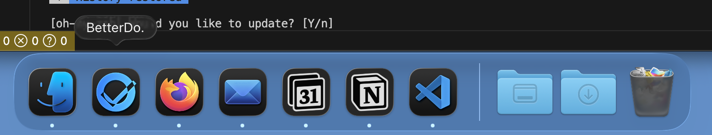
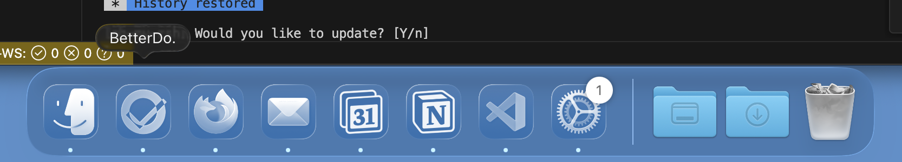
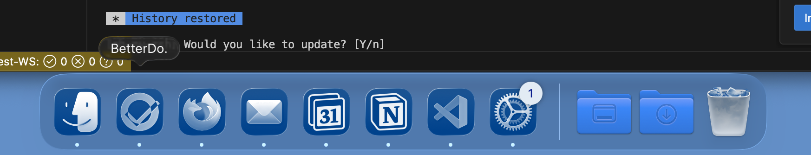

Apple recently [introduced their Liquid Glass redesign](https://www.apple.com/ca/newsroom/2025/06/apple-introduces-a-delightful-and-elegant-new-software-design/) in both iOS 26 and macOS Tahoe. This new design language emphasizes translucency, depth, and a frosted glass effect that enhances the visual appeal of app icons and interfaces. Regardless of personal opinions on the design, as developers we should strive to keep our applications visually aligned with the latest OS aesthetics.

## The Different Styles and How They Work

When you go to `Settings > Appearance`, you have the option to customize the appearance of app icons in your Dock. See the illustrations below for the available options. For reference, I’ll use my app, [BetterDo](https://betterdo.app), which is an installable PWA.

- **Default** – This is the standard icon style, with some slight depth and shadowing applied (IMO, this doesn’t look great, but it also doesn’t seem to be customizable).
  
- **Dark** – This uses your icon, but with the background darkened across all icons.
  
- **Clear** – This mode applies masking to your image to give it a glass / clear effect.
  
- **Tinted** – This is very similar to Clear, but with an additional user-defined tint applied.
  

**The functionality is very similar on iOS**, but for the sake of this blog post, we’re focusing on macOS. The same rules and logic described below also apply to iOS.

## How It Works for PWAs

When you first upgrade to the new OS version, you may notice that some applications don’t respect the appearance settings above and always show the default icon style. This makes those apps feel old and outdated.

**PWAs should automatically get the new theming**—assuming they follow the (currently undocumented) logic described below. Even then, this also assumes that the app’s icons were designed with the new Liquid Glass design in mind.

## Issues You Might Face

### Icon Always Uses the Default Theme

If your app always shows the default icon style in Dark, Clear, or Tinted modes, the most likely culprit is that [your icons are defined only in `manifest.json`](https://developer.mozilla.org/en-US/docs/Web/Progressive_web_apps/Manifest/Reference/icons). This makes sense, as this is the standard cross-platform way to define icons.

However, to get the new Liquid Glass treatment on Apple platforms, you also need to define an `apple-touch-icon` link in the HTML `<head>`. See [BetterDo’s icon](https://betterdo.app/icon-apple.png) as an example.

```html
<link rel="apple-touch-icon" sizes="180x180" href="/your-path.png" />
```

This took me a while to figure out, because I assumed defining icons in `manifest.json` would be sufficient. It appears, however, that Apple is still relying on this older mechanism to apply the new Liquid Glass effects.

## Designing Icons for Liquid Glass

When designing your icons, keep the following tips in mind to ensure they look good with Liquid Glass effects applied:

- **Use Simple Colors** – If your icon includes lots of effects (shadows, gradients, etc.), it may not translate well once Liquid Glass effects are applied.
- **Keep a White or Light Background** – Apple seems to apply an algorithm to adapt your icon for Liquid Glass. Having a white or light background appears to produce better results. Your best bet is to create a small sandbox app and test multiple variations until you find one that works well.
- **Avoid Fine Details** – Small or intricate details may get lost or distorted once Liquid Glass effects are applied. Keep the design simple and bold.
- **Test Across Themes** – Make sure to test your icons in all Liquid Glass modes (Default, Dark, Clear, Tinted) to ensure they look good in every context.

Apple does provide documentation on [Designing App Icons for Liquid Glass](https://developer.apple.com/design/human-interface-guidelines/macos/icons-and-images/app-icon/#designing-for-liquid-glass), but it lacks any PWA-specific guidance.

## Use Icon Composer

To help visualize how your icons will look with Liquid Glass effects applied, Apple provides an [Icon Composer](https://developer.apple.com/icon-composer/). This tool lets you upload your icon designs and preview them across different themes and contexts.

The tool is intended for native apps, and there’s no PWA-specific equivalent. Still, it’s useful for getting a general sense of how your icons will look. One important thing to keep in mind is that native apps can define multiple layers, whereas PWAs can only define a single image.

## Good Luck!

I wrote this post because there was essentially no documentation on how to get PWAs working with the new Liquid Glass design. I hope this helps you get your PWA icons looking great on the latest Apple OS versions—and that Apple provides better documentation and tooling for PWA developers in the future.
